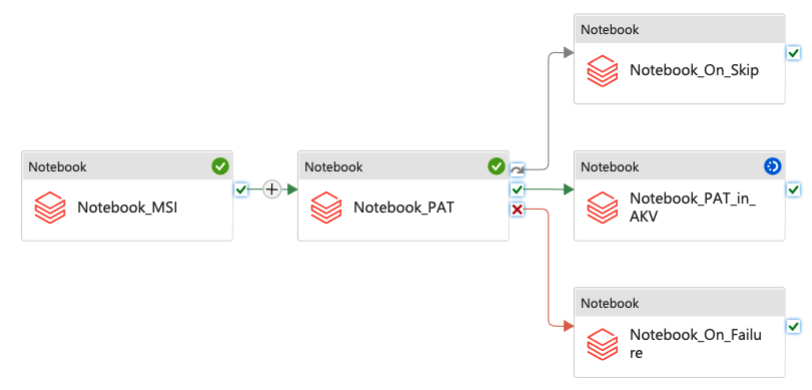

## Example of setting Azure Data Factory with Azure Databricks and different authentication methods

This Terraform code does following:

* Creates Azure Data Factory (ADF) with system-assigned managed identity.
* In existing Azure Databricks workspace configures following:
  * Creates instance pool for faster startup.
  * Creates a sample notebook that will be used in the ADF pipeline.
  * Creates a Personal Access Token (PAT) and stores it in a specified Azure KeyVault.
  * Adds ADF's managed identity as Databricks Service Principal and gives necessary permissions.
* Creates 3 linked Databricks inside ADF with differently configured authentication:
  * with PAT specified directly inside the pipeline (**insecure prefer not to use!**).
  * with PAT that will be pulled from the Azure KeyVault.
  * with ADF's managed identity.
* Creates Complex ADF pipeline (see image below) that demonstrates use of all configured linked activities.

To use this code - configure necessary variables in the `terraform.tfvars`, and do `terraform plan`, `terraform apply`.  By default it's configured to use `azure-cli` authentication.
