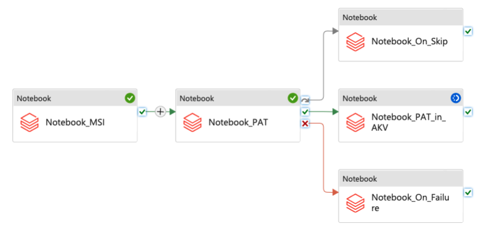

## Example of setting Azure Data Factory with Azure Databricks and different authentication methods

This Terraform code does following:

* Creates Azure Data Factory (ADF) with system-assigned managed identity.
* In existing Azure Databricks workspace configures following:
  * Creates instance pool for faster startup.
  * Creates a sample notebook that will be used in the ADF pipeline.
  * Creates a Personal Access Token (PAT) and stores it in a specified Azure KeyVault.
  * Adds ADF's managed identity as Databricks Service Principal and gives necessary permissions.
* Creates 3 linked Databricks inside ADF with differently configured authentication:
  * with PAT specified directly inside the pipeline (**insecure prefer not to use!**).
  * with PAT that will be pulled from the Azure KeyVault.
  * with ADF's managed identity.
* Creates Complex ADF pipeline (see image below) that demonstrates use of all configured linked activities.

To use this code - configure necessary variables in the `terraform.tfvars`, and do `terraform plan`, `terraform apply`.  By default it's configured to use `azure-cli` authentication.

<!-- BEGIN_TF_DOCS -->
## Requirements

| Name | Version |
|------|---------|
|  [azuread](#requirement\_azuread) | 2.47.0 |
|  [azurerm](#requirement\_azurerm) | ~> 3.0 |
|  [databricks](#requirement\_databricks) | ~> 1.0 |

## Providers

| Name | Version |
|------|---------|
|  [azuread](#provider\_azuread) | 2.47.0 |
|  [azurerm](#provider\_azurerm) | 3.116.0 |
|  [databricks](#provider\_databricks) | 1.51.0 |
|  [time](#provider\_time) | 0.12.0 |

## Modules

No modules.

## Resources

| Name | Type |
|------|------|
| [azurerm_data_factory.this](https://registry.terraform.io/providers/hashicorp/azurerm/latest/docs/resources/data_factory) | resource |
| [azurerm_data_factory_linked_service_azure_databricks.akv_pat_linked](https://registry.terraform.io/providers/hashicorp/azurerm/latest/docs/resources/data_factory_linked_service_azure_databricks) | resource |
| [azurerm_data_factory_linked_service_azure_databricks.msi_linked](https://registry.terraform.io/providers/hashicorp/azurerm/latest/docs/resources/data_factory_linked_service_azure_databricks) | resource |
| [azurerm_data_factory_linked_service_azure_databricks.pat_linked](https://registry.terraform.io/providers/hashicorp/azurerm/latest/docs/resources/data_factory_linked_service_azure_databricks) | resource |
| [azurerm_data_factory_linked_service_key_vault.this](https://registry.terraform.io/providers/hashicorp/azurerm/latest/docs/resources/data_factory_linked_service_key_vault) | resource |
| [azurerm_data_factory_pipeline.pipeline](https://registry.terraform.io/providers/hashicorp/azurerm/latest/docs/resources/data_factory_pipeline) | resource |
| [azurerm_key_vault_access_policy.adf](https://registry.terraform.io/providers/hashicorp/azurerm/latest/docs/resources/key_vault_access_policy) | resource |
| [azurerm_key_vault_secret.pat](https://registry.terraform.io/providers/hashicorp/azurerm/latest/docs/resources/key_vault_secret) | resource |
| [databricks_instance_pool.adf](https://registry.terraform.io/providers/databricks/databricks/latest/docs/resources/instance_pool) | resource |
| [databricks_notebook.adf_notebook](https://registry.terraform.io/providers/databricks/databricks/latest/docs/resources/notebook) | resource |
| [databricks_permissions.adf_notebook_usage](https://registry.terraform.io/providers/databricks/databricks/latest/docs/resources/permissions) | resource |
| [databricks_permissions.adf_pool_usage](https://registry.terraform.io/providers/databricks/databricks/latest/docs/resources/permissions) | resource |
| [databricks_service_principal.adf_mi](https://registry.terraform.io/providers/databricks/databricks/latest/docs/resources/service_principal) | resource |
| [databricks_token.pat](https://registry.terraform.io/providers/databricks/databricks/latest/docs/resources/token) | resource |
| [time_sleep.wait_10_seconds](https://registry.terraform.io/providers/hashicorp/time/latest/docs/resources/sleep) | resource |
| [azuread_service_principal.adf](https://registry.terraform.io/providers/hashicorp/azuread/2.47.0/docs/data-sources/service_principal) | data source |
| [azurerm_databricks_workspace.this](https://registry.terraform.io/providers/hashicorp/azurerm/latest/docs/data-sources/databricks_workspace) | data source |
| [azurerm_key_vault.this](https://registry.terraform.io/providers/hashicorp/azurerm/latest/docs/data-sources/key_vault) | data source |
| [azurerm_resource_group.this](https://registry.terraform.io/providers/hashicorp/azurerm/latest/docs/data-sources/resource_group) | data source |
| [databricks_current_user.me](https://registry.terraform.io/providers/databricks/databricks/latest/docs/data-sources/current_user) | data source |
| [databricks_node_type.smallest](https://registry.terraform.io/providers/databricks/databricks/latest/docs/data-sources/node_type) | data source |
| [databricks_spark_version.latest_lts](https://registry.terraform.io/providers/databricks/databricks/latest/docs/data-sources/spark_version) | data source |

## Inputs

| Name | Description | Type | Default | Required |
|------|-------------|------|---------|:--------:|
|  [adf\_name](#input\_adf\_name) | n/a | `string` | n/a | yes |
|  [akv\_name](#input\_akv\_name) | n/a | `string` | n/a | yes |
|  [rg\_name](#input\_rg\_name) | n/a | `string` | n/a | yes |
|  [ws\_name](#input\_ws\_name) | n/a | `string` | n/a | yes |

## Outputs

| Name | Description |
|------|-------------|
|  [mi\_client\_id](#output\_mi\_client\_id) | n/a |
<!-- END_TF_DOCS -->