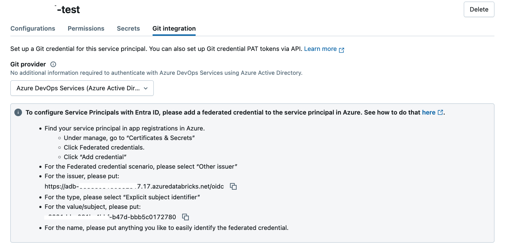
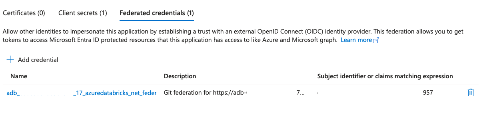

# Setting up Federated Credentials for Azure Service Principal to connect to Azure DevOps repository from Databricks

For quite a long time, connecting Azure service principal to Azure DevOps repositories was a bit of challenge - you either were need to use personal access token (PAT) of a real user (bad idea, as users may leave the company), or generate an Entra ID access token and set it as a PAT before each operation with Databricks Git Folders.

But now it's possible to configure credentials federation and token exchange will happen automatically without the need to specify personal access tokens.  Inside the Azure Databricsk workspace UI it could be configured as following:

but we'll do it using the Terraform that will generate all necessary objects in Entra ID and also inside the Azure Databricks workspace.  As a result, we'll be able to perform a checkout of a Git repository hosted in Azure DevOps.

## Prerequisites

1. Azure service principal should be added to Azure Databricks workspace and [Azure DevOps organization](https://learn.microsoft.com/en-us/azure/devops/integrate/get-started/authentication/service-principal-managed-identity?view=azure-devops#2-add-and-manage-service-principal-in-an-azure-devops-organization).
2. You should have permissions to configure [federated credentials for a given service principal](https://learn.microsoft.com/en-us/entra/workload-id/workload-identity-federation-create-trust).

## Setting it up

*Note*: You need to use Databricks provider >= 1.78 as it contains fixes to correctly handle the `force` option for service principals. 

You need to specify in the `terraform.tfvars` the values for the following variables:

* `databricks_host` - URL of Azure Databricks workspace (without trailing slash, and org ID, i.e., `https://adb-123417477717.17.azuredatabricks.net`)
* `entra_client_id` - Client/Application ID of an Azure service principal.
* `entra_client_secret` - Client secret of an Azure service principal.
* `entra_tenant_id` - Tenant ID where Azure service principal is registered.
* `ado_repo_url` - HTTPS URL of a Git repository inside Azure DevOps.

Connection to Azure Databricks workspace will be authenticated using [Azure service principal authentication](https://registry.terraform.io/providers/databricks/databricks/latest/docs#authenticating-with-azure-managed-service-principal-using-client-secret), and connection to Entra ID will use the Azure CLI authentication (if you want to use another method, consult the documentation for `azuread` provider).

After all things are configured, just follow the standard flow:

1. `terraform init`
2. `terraform plan` to see what changes will be made.
3. `terraform apply` to perform changes.

After `terraform apply` the changes should be visible in the Entra ID, and Git folder will be created in a home folder of Azure service principal inside the Databricks workspace.

