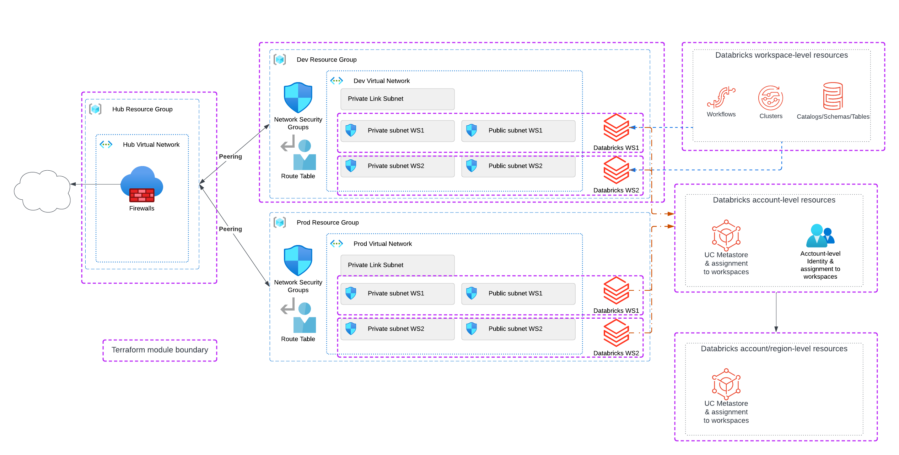

# Azure Databricks Hub-Spoke Multi-Workspace Deployment

This Terraform project demonstrates deploying Azure Databricks workspaces using a **hub-spoke network architecture** with multiple environments (Dev/Prod) and workspace-level customization.

## Architecture Overview



The architecture consists of:

- **Hub Resource Group**: Central hub VNet for shared networking resources (firewalls, connectivity)
- **Dev Resource Group**: Development spoke VNet with Databricks workspaces (WS1, WS2)
- **Prod Resource Group**: Production spoke VNet with Databricks workspaces (WS1, WS2)
- **VNet Peering**: Bi-directional peering between hub and each spoke
- **Private Link Subnets**: Optional Secure connectivity for Databricks workspaces
- **Resources in Databricks workspaces**: Modules for different project types (Data Engineering, BI, ...)

### Network CIDR Ranges

| Network | CIDR Block |
|---------|------------|
| Hub VNet | `10.0.0.0/16` |
| Dev VNet | `10.1.0.0/16` |
| Prod VNet | `10.2.0.0/16` |

## Project Structure

```
.
├── azure-objects/          # Core Azure infrastructure
│   ├── main.tf             # Local variables and CIDR definitions
│   ├── hub.tf              # Hub resource group and VNet
│   ├── dev.tf              # Dev spoke VNet and workspaces
│   ├── prod.tf             # Prod spoke VNet and workspaces
│   └── providers.tf        # Provider configuration
│
├── databricks-dev/         # Dev workspace customization
│   ├── ws1.tf              # WS1 configuration, groups, and access
│   ├── locals.tf           # Environment-specific variables
│   └── providers.tf        # Provider configuration
│
├── databricks-prod/        # Prod workspace customization
│   ├── ws1.tf              # WS1 configuration, groups, and access
│   ├── locals.tf           # Environment-specific variables
│   └── providers.tf        # Provider configuration
│
├── project1/               # Example project deployment
│   ├── main.tf.tf          # Data sources and provider setup
│   ├── dlt.tf              # Delta Live Tables pipeline
│   ├── jobs.tf             # Databricks jobs
│   ├── notebooks.tf        # Notebook resources
│   ├── locals.tf           # Project-specific variables
│   └── providers.tf        # Provider configuration
│
└── modules/                # Reusable Terraform modules
    ├── hub-vnet/           # Hub virtual network module
    ├── spoke-vnet/         # Spoke VNet with NSG, routes, peering
    ├── workspace/          # Databricks workspace (VNet-injected)
    ├── ws-bi-group/        # BI user group + SQL warehouse
    ├── ws-de-group/        # DE group + clusters + SQL warehouse
    ├── ws-customize-dev/   # Dev workspace security config
    └── ws-customize-prod/  # Prod workspace security config
```

## Modules

### `hub-vnet`

Creates the central hub virtual network for shared connectivity.

### `spoke-vnet`

Creates a spoke VNet with:

- Private Link subnet for secure connectivity
- VNet peering to hub (bidirectional)
- Network Security Group for Databricks
- Route table with local VNet and default routes

### `workspace`

Deploys a VNet-injected Databricks workspace with:

- Premium SKU
- No public IP (secure cluster connectivity)
- Public and private subnets with delegations
- NSG and route table associations

### `ws-bi-group`

Creates a BI (Business Intelligence) team group with:

- Databricks group with SQL access
- User provisioning
- SQL warehouse (configurable size and serverless)
- CAN_USE permissions on the warehouse

### `ws-de-group`

Creates a Data Engineering team group with:

- Databricks group with workspace and SQL access
- User provisioning
- Shared auto-scaling cluster
- Serverless SQL warehouse (PRO)
- CAN_MANAGE permissions on resources

### `ws-customize-dev`
Dev workspace configuration:

- Token policies (90-day max lifetime)
- IP access lists (allow/block)
- Admin user assignments

### `ws-customize-prod`
Prod workspace configuration:

- Service principal admin assignments
- Production-grade security settings

## Prerequisites

- [Terraform](https://www.terraform.io/downloads) >= 1.0
- [Azure CLI](https://docs.microsoft.com/en-us/cli/azure/install-azure-cli) authenticated
- Azure subscription with appropriate permissions
- Databricks account with Unity Catalog (optional)

## Provider Versions

| Provider | Version |
|----------|---------|
| azurerm | 3.76.0 |
| databricks | 1.28.0 |

## Deployment Order

This project uses multiple Terraform configurations that must be applied in order:

1. **Azure Infrastructure** (`azure-objects/`)
 
   ```bash
   cd azure-objects
   terraform init
   terraform plan
   terraform apply
   ```

2. **Dev Workspace Customization** (`databricks-dev/`)

   ```bash
   cd databricks-dev
   terraform init
   terraform plan
   terraform apply
   ```

3. **Prod Workspace Customization** (`databricks-prod/`)

   ```bash
   cd databricks-prod
   terraform init
   terraform plan
   terraform apply
   ```

4. **Project Deployment** (`project1/`) - Optional

   ```bash
   cd project1
   terraform init
   terraform plan
   terraform apply
   ```

## Key Features

### Network Security

- **VNet Injection**: All workspaces deployed into customer-managed VNets
- **No Public IPs**: Secure cluster connectivity enabled
- **Hub-Spoke Topology**: Centralized network management and egress control
- **NSG Protection**: Dedicated security groups for Databricks subnets

### Environment Separation

- Separate resource groups for Dev and Prod
- Different workspace customization per environment
- Independent VNets with peering to shared hub

### Team Management

- **BI Groups**: SQL-focused access with dedicated warehouses
- **DE Groups**: Full workspace access with shared clusters and SQL warehouses
- Permissions automatically granted at group level

### Workspace Security

- Token lifetime policies
- IP access lists (allow/block)
- Admin assignments (users or service principals)

## Configuration

### Customizing the Deployment

Edit `azure-objects/main.tf` to modify:

- `name_prefix`: Resource naming prefix
- `location`: Azure region
- CIDR ranges for hub and spokes

### Adding New Workspaces

1. Add new workspace module calls in `dev.tf` or `prod.tf`
2. Configure subnet CIDRs for the new workspace
3. Create corresponding customization in `databricks-dev/` or `databricks-prod/`

### Adding New Teams

Use the `ws-bi-group` or `ws-de-group` modules:

```hcl
module "team_name" {
  source     = "../modules/ws-bi-group"
  group_name = "Team Name"
  user_names = ["user1@domain.com", "user2@domain.com"]
  providers = {
    databricks = databricks.ws1
  }
}
```

## Cleanup

Destroy resources in reverse order:

```bash
cd project1 && terraform destroy
cd ../databricks-prod && terraform destroy
cd ../databricks-dev && terraform destroy
cd ../azure-objects && terraform destroy
```

## Related Resources

- [Azure Databricks VNet Injection](https://learn.microsoft.com/en-us/azure/databricks/administration-guide/cloud-configurations/azure/vnet-inject)
- [Databricks Terraform Provider](https://registry.terraform.io/providers/databricks/databricks/latest/docs)
- [Azure Hub-Spoke Network Topology](https://learn.microsoft.com/en-us/azure/architecture/reference-architectures/hybrid-networking/hub-spoke)


<!-- BEGIN_TF_DOCS -->
## Requirements

No requirements.

## Providers

No providers.

## Modules

No modules.

## Resources

No resources.

## Inputs

No inputs.

## Outputs

No outputs.
<!-- END_TF_DOCS -->