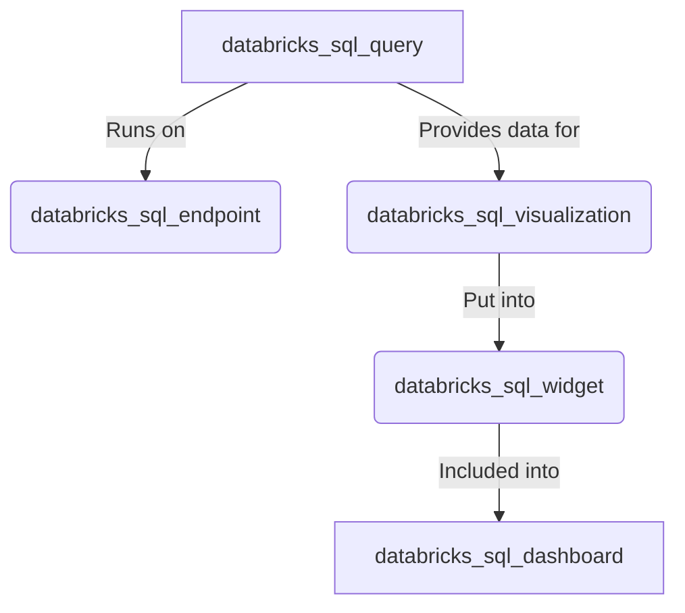

# Demonstration of how to use Terraform to create Databricks SQL resources

This folder contains Terraform code to create Databricks SQL resources - [SQL Warehouses](https://registry.terraform.io/providers/databricks/databricks/latest/docs/resources/sql_endpoint), [queries](https://registry.terraform.io/providers/databricks/databricks/latest/docs/resources/sql_query) and [dashboards](https://registry.terraform.io/providers/databricks/databricks/latest/docs/resources/sql_dashboard).  (Please note that original resources where generated by [Terraform resource exporter](https://registry.terraform.io/providers/databricks/databricks/latest/docs/guides/experimental-exporter)), and not written manually from scratch.  More examples could be found in the [Databricks Terraform examples repository](https://github.com/databricks/terraform-databricks-examples).

The query & dashboard use a table generated by the [DNS Analytics Solution Accelerator](https://github.com/databricks-industry-solutions/dns-analytics), so you need to run that solution accelerator to get data, and then provide name of the generated database in the `database_name` variable.  You also need to configure authentication to your Databricks workspace as described in [documentation](https://registry.terraform.io/providers/databricks/databricks/latest/docs#authentication).

Following diagram shows relationships between Terraform resources related to Databricks SQL:

