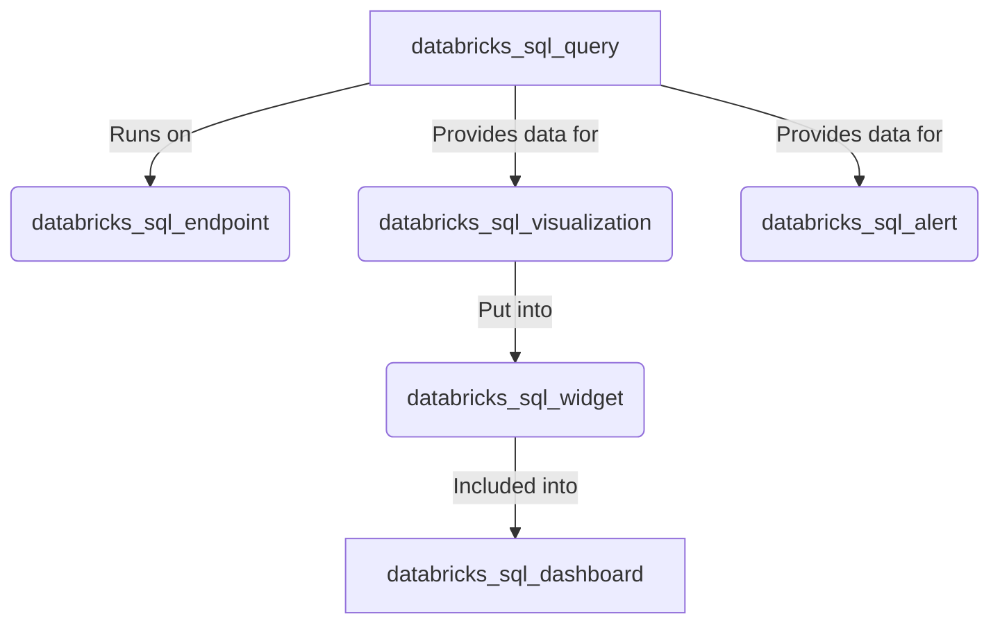

# Demonstration of how to use Terraform to create Databricks SQL resources

This folder contains Terraform code to create Databricks SQL resources - [SQL Warehouses](https://registry.terraform.io/providers/databricks/databricks/latest/docs/resources/sql_endpoint), [queries](https://registry.terraform.io/providers/databricks/databricks/latest/docs/resources/sql_query), [dashboards](https://registry.terraform.io/providers/databricks/databricks/latest/docs/resources/sql_dashboard) and [alerts](https://registry.terraform.io/providers/databricks/databricks/latest/docs/resources/sql_alert).  (Please note that original resources where generated by [Terraform resource exporter](https://registry.terraform.io/providers/databricks/databricks/latest/docs/guides/experimental-exporter)), and not written manually from scratch.  More examples could be found in the [Databricks Terraform examples repository](https://github.com/databricks/terraform-databricks-examples).

The query & dashboard use a table generated by the [DNS Analytics Solution Accelerator](https://github.com/databricks-industry-solutions/dns-analytics), so you need to run that solution accelerator to get data, and then provide name of the generated database in the `database_name` variable.  You also need to configure authentication to your Databricks workspace as described in [documentation](https://registry.terraform.io/providers/databricks/databricks/latest/docs#authentication).

Following diagram shows relationships between Terraform resources related to Databricks SQL:

```mermaid
graph TD
    A[databricks_sql_query] -->|Runs on| B(databricks_sql_endpoint)
    A -->|Provides data for| C(databricks_sql_visualization)
    C -->|Put into| D(databricks_sql_widget)
    D -->|Included into| E[databricks_sql_dashboard]
    A -->|Provides data for| F(databricks_sql_alert)
```

<!-- BEGIN_TF_DOCS -->
## Requirements

| Name | Version |
|------|---------|
|  [databricks](#requirement\_databricks) | ~> 1.0 |

## Providers

| Name | Version |
|------|---------|
|  [databricks](#provider\_databricks) | 1.21.0 |

## Modules

No modules.

## Resources

| Name | Type |
|------|------|
| [databricks_job.this](https://registry.terraform.io/providers/databricks/databricks/latest/docs/resources/job) | resource |
| [databricks_sql_alert.demo_alert](https://registry.terraform.io/providers/databricks/databricks/latest/docs/resources/sql_alert) | resource |
| [databricks_sql_dashboard.demo_dashboard](https://registry.terraform.io/providers/databricks/databricks/latest/docs/resources/sql_dashboard) | resource |
| [databricks_sql_endpoint.demo](https://registry.terraform.io/providers/databricks/databricks/latest/docs/resources/sql_endpoint) | resource |
| [databricks_sql_query.demo_query](https://registry.terraform.io/providers/databricks/databricks/latest/docs/resources/sql_query) | resource |
| [databricks_sql_visualization.bar_vis](https://registry.terraform.io/providers/databricks/databricks/latest/docs/resources/sql_visualization) | resource |
| [databricks_sql_visualization.map_vis](https://registry.terraform.io/providers/databricks/databricks/latest/docs/resources/sql_visualization) | resource |
| [databricks_sql_visualization.table_vis](https://registry.terraform.io/providers/databricks/databricks/latest/docs/resources/sql_visualization) | resource |
| [databricks_sql_widget.bar_widget](https://registry.terraform.io/providers/databricks/databricks/latest/docs/resources/sql_widget) | resource |
| [databricks_sql_widget.f2c52db4_e05a_4658_8fd1_913a462d684d8e7e941f_9c1d_465e_b17e_4f0d1dab7720](https://registry.terraform.io/providers/databricks/databricks/latest/docs/resources/sql_widget) | resource |
| [databricks_sql_widget.map_widget](https://registry.terraform.io/providers/databricks/databricks/latest/docs/resources/sql_widget) | resource |

## Inputs

| Name | Description | Type | Default | Required |
|------|-------------|------|---------|:--------:|
|  [database\_name](#input\_database\_name) | SQL Database name generated by DNS Analytics solution accelerator | `string` | n/a | yes |

## Outputs

No outputs.
<!-- END_TF_DOCS -->